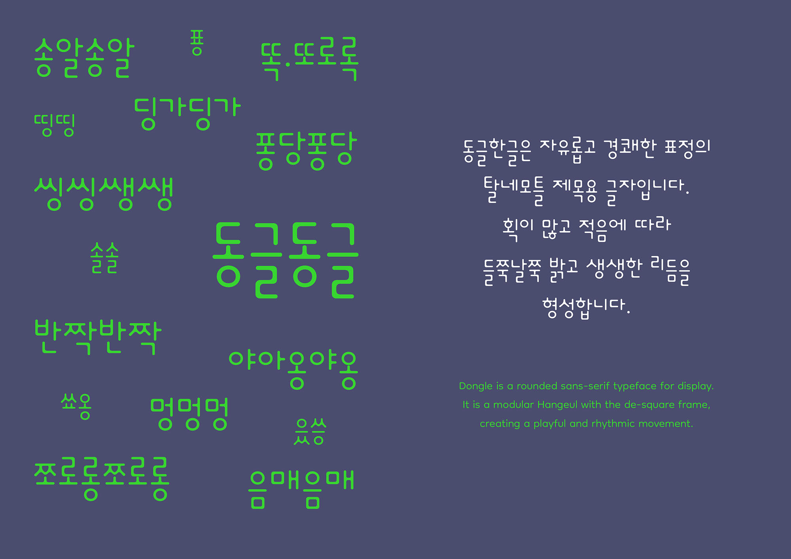

# Dongle Project

Dongle(동글) is a rounded sans-serif typeface for display. It is a modular Hangeul with the de-square frame, creating a playful and rhythmic movement. The name, Dongle(동글) comes from a Korean onomatopoeia, meaning 'rounded or curved shape(with adorable impression)’. 

Dongle was originally designed as a 'Jamo(consonant and vowel in Hangeul) typing module' for the author's student project. Later it revised into ‘syllabic module’ to be released to the public. As the character size varies according to the syllable structure, Dongle typeface is much smaller compared to other square frame Korean typefaces. Therefore, it is better to adjust the font size visually to your liking, rather than relying on the point size of the editing program.

It is designed especially for Hangeul typography, but it also includes Latin alphabet as a part of KS X 1001. This typeface has a light, medium, and bold weight.

## Basic Information
Dongle(동글) is a revised name of 'Dongle Hangeul(동글한글)' which was released in 2012.
It consists of a full set of modern Hangeul syllables(11,172 characters), Google Latin plus set, and punctuations and symbols in KS X 1001. 

- Dongle Hangeul Light, Medium, Bold were released in 2012.
- Some of the Latin alphabets and symbols are revised for Ver.2.0 in 2020.
- Medium weight renamed to Regular in Ver.2.0  

## Designer
Yanghee Ryu

## License
SIL Open Font License ([OFL.txt](OFL.txt))
